# LoanInquiry AI — Flow Diagrams (Project 2)

> All diagrams use [Mermaid](https://mermaid.js.org/) syntax.
> Render in GitHub, VS Code (Mermaid Preview plugin), or [mermaid.live](https://mermaid.live).

---

## Table of Contents

1. [LangGraph v2 Pipeline — Full Flow](#1-langgraph-v2-pipeline--full-flow)
2. [Google ADK Pipeline — How Declarative Routing Works](#2-google-adk-pipeline--how-declarative-routing-works)
3. [InquiryState — Memory Flow Through Nodes](#3-inquirystate--memory-flow-through-nodes)
4. [Intent Routing Decision Tree](#4-intent-routing-decision-tree)
5. [InputGuardrail — Detailed Flow](#5-inputguardrail--detailed-flow)
6. [Memory System — BufferMemory vs SummaryMemory](#6-memory-system--buffermemory-vs-summarymemory)
7. [POST /v2/chat — Full Request Lifecycle](#7-post-v2chat--full-request-lifecycle)
8. [Agent State Read/Write Map](#8-agent-state-readwrite-map)
9. [Project 1 vs Project 2 — Architecture Comparison](#9-project-1-vs-project-2--architecture-comparison)

---

## 1. LangGraph v2 Pipeline — Full Flow

The v2 pipeline has 7 nodes wired by two conditional routing functions. The key insight: the eligibility path is **sequential** (policy must retrieve context *before* eligibility can apply it), while all other paths are single-specialist then synthesis.

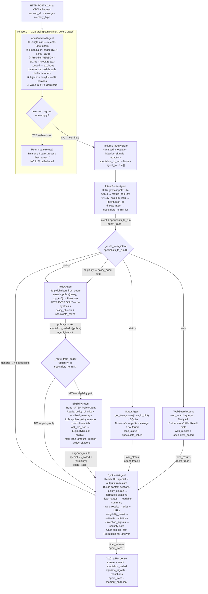

---

## 2. Google ADK Pipeline — How Declarative Routing Works

The ADK pipeline is a completely different approach. Instead of drawing edges in code, you write `description` strings on each sub_agent — the **triage LLM reads those descriptions** and decides which specialist to call. This diagram shows the conceptual flow inside ADK.

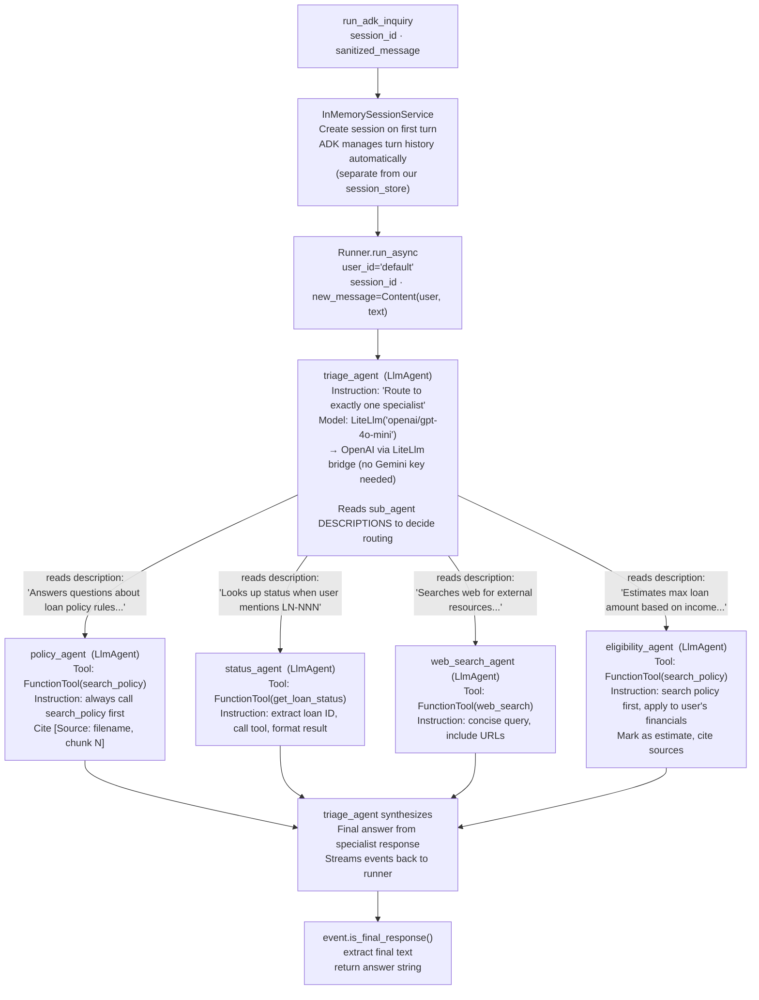

---

## 3. InquiryState — Memory Flow Through Nodes

`InquiryState` is a `TypedDict` with `total=False` — every field is optional. Each node reads what it needs and writes only what it owns. Unlike Project 1, trace accumulation is **manual**: each agent does `existing_trace + [new_entry]` (no `Annotated[list, operator.add]`).

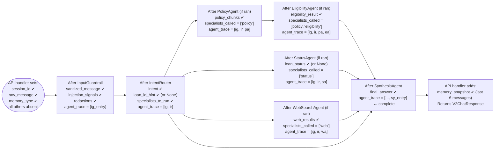

### Manual trace accumulation (difference from Project 1)

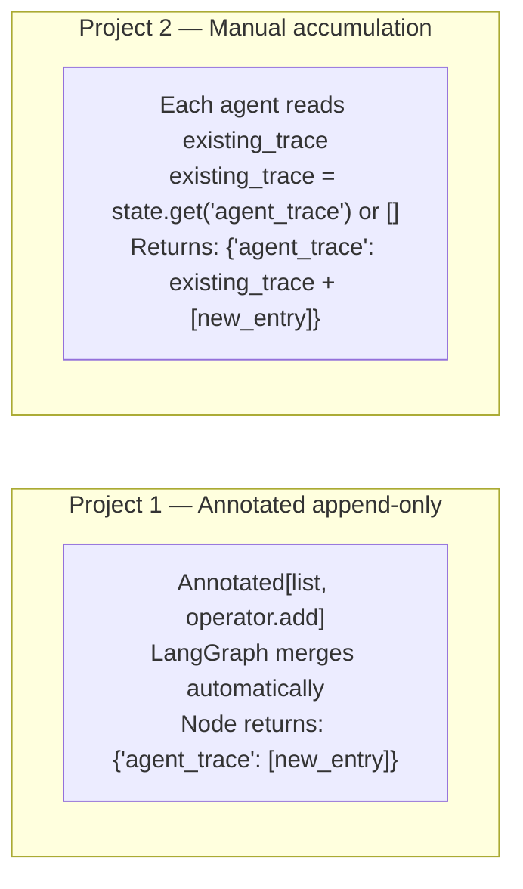

---

## 4. Intent Routing Decision Tree

Two routing decisions happen in the LangGraph v2 pipeline. The **IntentRouter** fires first (with a regex fast path), then a second conditional edge fires after PolicyAgent to handle the eligibility two-step.

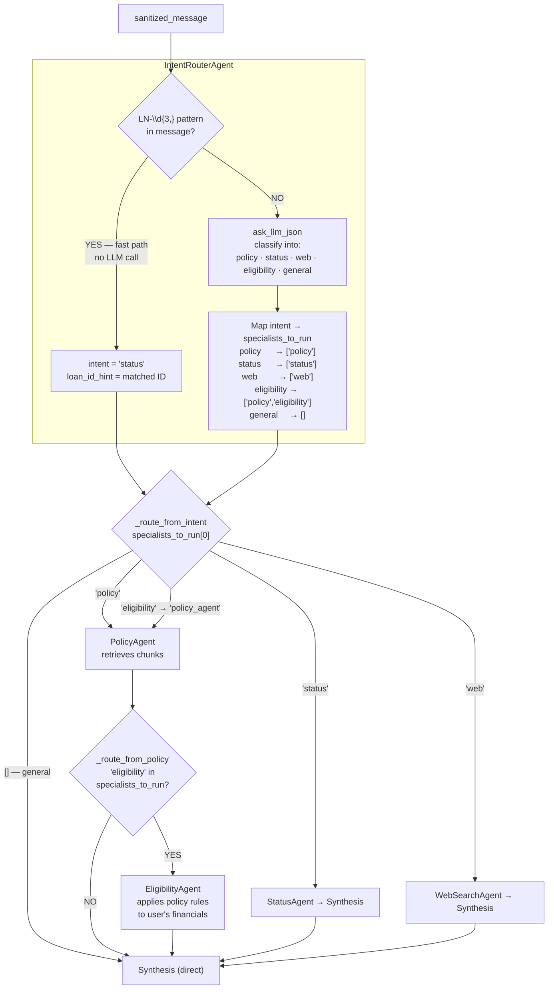

---

## 5. InputGuardrail — Detailed Flow

The guardrail is called **twice**: once as a LangGraph node (inside the graph, for the v2 LangGraph pipeline) and once as a plain function call in `main.py` (before the ADK pipeline). In both cases the logic is identical.

**Key improvement over Project 1**: Presidio entity scope is restricted — `US_BANK_NUMBER` is excluded from Presidio because its numeric pattern collides with large dollar amounts (e.g., `$12000000`). A negative-lookbehind regex handles bank numbers instead.

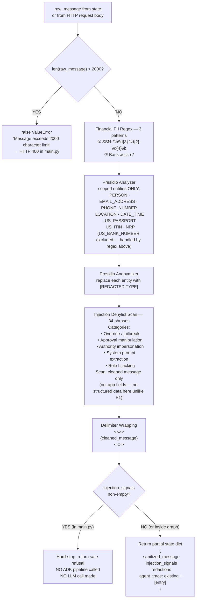

---

## 6. Memory System — BufferMemory vs SummaryMemory

The memory system lives **outside** the LangGraph graph — it's managed by `main.py` after each turn. The graph itself is stateless; memory is injected by reading `memory.format_for_prompt()` in the agent prompts.

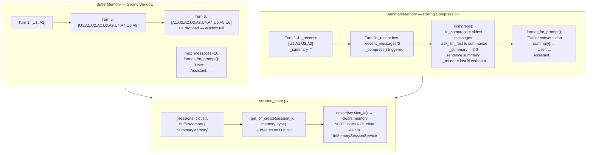

### When to use which

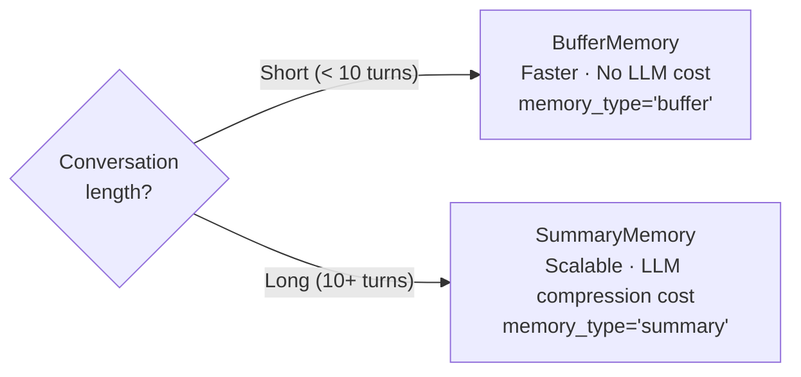

---

## 7. POST /v2/chat — Full Request Lifecycle

Step-by-step for the query: *"I earn $80k/year with a credit score of 710 — how much can I borrow for a mortgage?"* (eligibility intent).

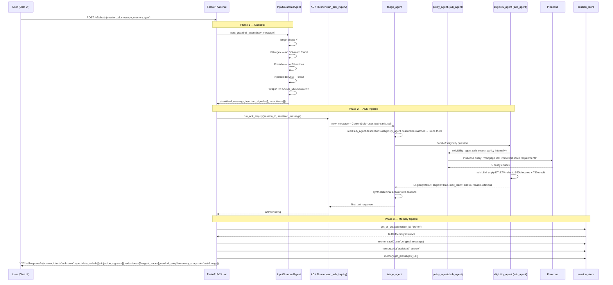

---

## 8. Agent State Read/Write Map

Every agent in the LangGraph v2 pipeline reads specific state keys and writes specific state keys. This table makes dependencies explicit — useful for understanding why agent ordering matters.

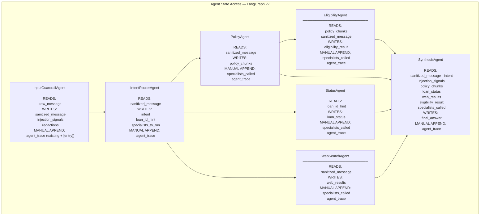

---

## 9. Project 1 vs Project 2 — Architecture Comparison

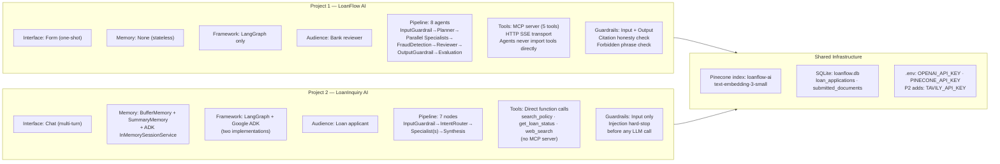

---

## Quick Reference — InquiryState Fields

| Field | Type | Set by | Read by |
|---|---|---|---|
| `session_id` | `str` | API handler | StatusAgent, session_store |
| `raw_message` | `str` | API handler | InputGuardrail |
| `memory_type` | `str` | API handler | session_store |
| `sanitized_message` | `str` | InputGuardrail | IntentRouter, PolicyAgent, WebSearchAgent, EligibilityAgent, Synthesis |
| `injection_signals` | `list[str]` | InputGuardrail | Synthesis (security note) |
| `redactions` | `list[str]` | InputGuardrail | API response |
| `intent` | `str` | IntentRouter | Synthesis (context), routing functions |
| `loan_id_hint` | `str\|None` | IntentRouter | StatusAgent |
| `specialists_to_run` | `list[str]` | IntentRouter | `_route_from_intent`, `_route_from_policy` |
| `policy_chunks` | `list[dict]` | PolicyAgent | EligibilityAgent, Synthesis |
| `loan_status` | `dict\|None` | StatusAgent | Synthesis |
| `web_results` | `list[dict]` | WebSearchAgent | Synthesis |
| `eligibility_result` | `dict\|None` | EligibilityAgent | Synthesis |
| `final_answer` | `str` | SynthesisAgent | API handler → response |
| `agent_trace` | `list[dict]` | Every node (manual append) | API handler → response |
| `specialists_called` | `list[str]` | PolicyAgent, StatusAgent, WebSearchAgent, EligibilityAgent | Synthesis, API response |
| `memory_snapshot` | `list[dict]` | API handler (after graph) | Response only |
