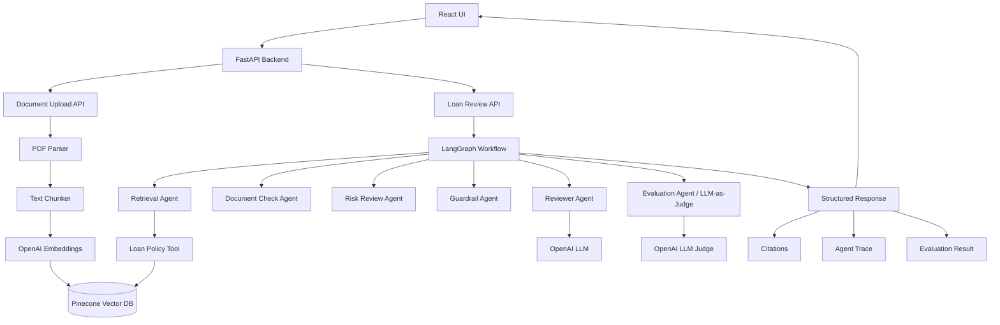

### Architecture Overview

# LoanFlow AI — Multi-Agent RAG Loan Review Assistant.

The system allows users to upload loan policy documents, extracts and chunks the document text, generates OpenAI embeddings, and stores the vectors in Pinecone. When a reviewer submits a loan review question, the LangGraph workflow retrieves relevant policy chunks through a LoanPolicyTool and passes that grounded context to specialized agents.

The workflow includes document checking, risk review, guardrail enforcement, reviewer guidance generation, and an LLM-as-Judge evaluation step. The response includes the AI recommendation, missing documents, risk flags, retrieved policy context, citations, guardrails, agent trace, and evaluation results.

## Project Overview

# LoanFlow AI — Multi-Agent RAG Loan Review Assistant is - A Retrieval-Augmented Generation (RAG) powered multi-agent loan review assistant built using FastAPI, LangGraph, OpenAI, Pinecone, and React.

The system ingests loan policy documents, stores semantic embeddings in Pinecone, retrieves relevant policy context using vector search, and uses multiple AI agents to generate grounded loan review guidance with citations, guardrails, and evaluation scoring.

The application demonstrates:
- Retrieval-Augmented Generation (RAG)
- Multi-agent orchestration
- Tool-based retrieval
- Guardrail enforcement
- LLM-as-Judge evaluation
- Grounded AI responses with citations

## Tech Stack

### Backend
- FastAPI
- LangGraph
- OpenAI API
- Pinecone
- Pydantic

### Frontend
- React

### AI Features
- RAG document retrieval
- OpenAI embeddings
- Multi-agent workflow
- LLM-as-Judge evaluation
- Guardrails and traceability

## Workflow

1. Upload loan policy PDF
2. Extract text from PDF
3. Chunk text into retrieval segments
4. Generate OpenAI embeddings
5. Store vectors in Pinecone
6. Retrieve relevant chunks for reviewer questions
7. Execute LangGraph multi-agent workflow
8. Generate grounded loan review guidance
9. Return citations, guardrails, and evaluation results

## Features

- PDF ingestion pipeline
- Semantic retrieval using Pinecone
- LangGraph agent orchestration
- LoanPolicyTool retrieval abstraction
- Risk signal detection
- Missing document detection
- Guardrail enforcement
- Citations and retrieved context
- LLM-as-Judge evaluation
- Agent trace visibility

## Example Question

"What should reviewer check if bank statements are missing?"

## Future Enhancements

- Additional financial review tools
- Fraud detection agent
- Income verification agent
- Multi-document retrieval
- Human approval workflow
- MCP-compatible tool layer
- Observability and telemetry
- Deployment scaling