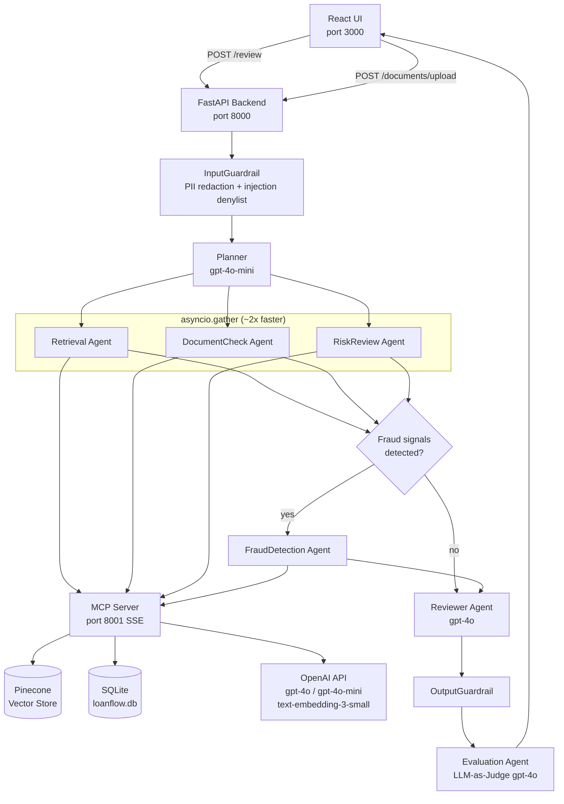

# LoanFlow AI — Multi-Agent RAG Loan Review Assistant

LoanFlow AI is a production-style multi-agent system that automates loan application review using Retrieval-Augmented Generation (RAG). A React frontend submits loan applications to a FastAPI backend, which runs them through a LangGraph pipeline of eight specialized agents — input guardrail, planner, three parallel specialists (retrieval, document check, risk review), optional fraud detection, reviewer, output guardrail, and an LLM-as-Judge evaluator. Tools are served by a standalone MCP (Model Context Protocol) server over SSE, keeping the agent layer fully decoupled from tool implementations. Policy knowledge lives in Pinecone; application data lives in SQLite. The result is a structured recommendation with citations, risk flags, missing-document alerts, guardrail verdicts, and a numeric quality score.

---

## Architecture



---

## Features

- **8-agent LangGraph pipeline** — each agent has a single responsibility and a typed Pydantic state contract
- **Parallel specialist execution** — Retrieval, DocumentCheck, and RiskReview run concurrently with `asyncio.gather`
- **MCP tool layer** — 5 tools served over SSE; agents are zero-coupling (LLM reads descriptions, never hardcoded tool names)
- **Hybrid PII redaction** — Microsoft Presidio for contextual entities (PERSON, EMAIL, PHONE) + regex for financial patterns (SSN, bank account, credit card)
- **Injection denylist** — 30 phrases across 5 attack categories; user input always wrapped in `<<<USER_QUESTION>>>` delimiters
- **LLM-as-Judge evaluation** — gpt-4o scores grounding, hallucination risk, and policy compliance; deterministic signals (risk/fraud flags) are exempt from penalty
- **RAG over policy PDF** — Pinecone semantic search with OpenAI `text-embedding-3-small`
- **Demo seed data** — 6 pre-loaded loan scenarios covering happy path through guardrail edge cases
- **LangSmith tracing** (optional) — toggle via env vars

---

## Prerequisites

| Tool | Version |
|------|---------|
| Python | 3.11+ |
| Node.js | 18+ |
| npm | 9+ |
| Docker + Docker Compose | 24+ (optional) |

You will also need:
- **OpenAI API key** with access to `gpt-4o`, `gpt-4o-mini`, and `text-embedding-3-small`
- **Pinecone account** with an index named `loanflow-policy` (dimension: 1536, metric: cosine)

---

## Environment Setup

Create `backend/.env` (never commit this file):

```env
# Required
OPENAI_API_KEY=sk-...
PINECONE_API_KEY=...
PINECONE_INDEX_NAME=loanflow-policy
MCP_SERVER_URL=http://localhost:8001/sse

# Optional — LangSmith tracing
LANGSMITH_TRACING=true
LANGSMITH_API_KEY=...
LANGSMITH_PROJECT=loanflow-ai-capstone
```

A template is provided at `backend/.env.example`.

---

## Local Development (3 terminals)

### Terminal 1 — MCP Server

```bash
cd mcp-server
pip install -r requirements.txt      # first time only
MCP_TRANSPORT=sse MCP_PORT=8001 python -m mcp_server.server
```

### Terminal 2 — Backend

```bash
cd backend
python -m venv .venv && source .venv/bin/activate   # first time only
pip install -r requirements.txt                      # first time only
python -m app.db.seed                                # seed 6 demo applications
uvicorn app.main:app --reload --port 8000
```

### Terminal 3 — Frontend

```bash
cd frontend
npm install      # first time only
npm run dev
```

The app is available at **http://localhost:3000**.

---

## First-Time Setup — Upload the Policy PDF

Before running a review you must index the loan policy document so the Retrieval agent has something to search.

**Option A — via the UI:**
1. Open http://localhost:3000
2. Click **Upload Policy** and select your loan policy PDF

**Option B — via curl:**
```bash
curl -X POST http://localhost:8000/documents/upload \
  -F "file=@/path/to/loan_policy.pdf"
```

A sample policy PDF is included at `backend/app/uploads/loan_policy.pdf`.

---

## Docker Deployment

```bash
docker compose up --build
```

This starts two services:
- `backend` on port 8000
- `mcp-server` on port 8001

The frontend is not included in Docker Compose — run it separately:

```bash
cd frontend
npm run dev          # development
# or
npm run build        # production build → serve dist/ with any static host
```

---

## API Reference

| Method | Endpoint | Description |
|--------|----------|-------------|
| `POST` | `/review` | Run full agent pipeline; returns `LoanReviewResponse` |
| `GET` | `/loans` | List all seeded loan applications |
| `GET` | `/loans/{loan_id}` | Get a single loan with submitted documents |
| `POST` | `/documents/upload` | Upload and index a policy PDF to Pinecone |
| `GET` | `/health` | Health check |

### POST /review — example request

```json
{
  "loan_id": "LN-002",
  "question": "What documents are missing for this application?"
}
```

### LoanReviewResponse — key fields

| Field | Type | Description |
|-------|------|-------------|
| `recommendation` | string | Reviewer guidance paragraph |
| `missing_documents` | list[str] | Documents required by policy but not submitted |
| `risk_flags` | list[str] | Risk signals detected (DTI, LTV, credit score, etc.) |
| `fraud_signals` | list[str] | Deterministic fraud indicators (if routed) |
| `citations` | list[str] | Policy chunks used to ground the answer |
| `guardrail_triggered` | bool | Whether input or output guardrail fired |
| `evaluation` | object | LLM-as-Judge scores and reasoning |
| `agent_trace` | list[str] | Ordered list of agents executed |

---

## Demo Scenarios

| Loan ID | Scenario | What It Tests |
|---------|----------|---------------|
| LN-001 | Small personal loan, full docs, good credit | Happy path — all agents pass |
| LN-002 | Large mortgage, missing income docs | DocumentCheck flags missing items |
| LN-003 | Self-employed applicant, high loan-to-income ratio | Fraud routing triggered |
| LN-004 | All risk factors elevated simultaneously | Full pipeline stress test |
| LN-005 | Zero-income applicant | Edge case handling |
| LN-006 | Injection string in borrower name field | InputGuardrail demo |

---

## Running Tests

```bash
cd backend
pytest tests/ -v
```

| Test File | Coverage |
|-----------|----------|
| `tests/test_input_guardrail.py` | 18 tests — PII redaction, injection denylist, delimiter wrapping |
| `tests/test_tool_runner.py` | 12 tests — MCP tool dispatch, error handling |
| `tests/test_agents.py` | Agent unit and integration tests |

---

## MCP Tools

All tools are registered in `mcp-server/mcp_server/registry.py` and served via FastMCP SSE.

| Tool | Description |
|------|-------------|
| `search_policy_tool` | Pinecone semantic search over indexed policy PDF chunks |
| `extract_requirements_tool` | LLM extracts required document types from retrieved policy chunks |
| `check_fraud_signals_tool` | Deterministic rule-based fraud signal detection |
| `get_loan_application_tool` | SQLite lookup by loan ID |
| `get_submitted_documents_tool` | SQLite lookup of documents submitted for a loan |

Agents never reference tool names directly. The LLM reads tool descriptions at runtime and selects tools autonomously.

---

## Project Structure

```
loanflow-ai-project1/
├── backend/
│   ├── app/
│   │   ├── agents/              # 8 LangGraph agents
│   │   │   ├── input_guardrail.py
│   │   │   ├── planner_agent.py
│   │   │   ├── retrieval_agent.py
│   │   │   ├── document_check_agent.py
│   │   │   ├── risk_review_agent.py
│   │   │   ├── fraud_detection_agent.py
│   │   │   ├── reviewer_agent.py
│   │   │   └── output_guardrail.py
│   │   ├── core/
│   │   │   ├── mcp/             # MCP client (connects to mcp-server SSE)
│   │   │   └── tool_runner.py   # LLM tool-calling loop
│   │   ├── db/
│   │   │   ├── database.py      # SQLite connection
│   │   │   └── seed.py          # 6 demo loan applications
│   │   ├── models/              # Pydantic v2 contracts
│   │   ├── routes/              # FastAPI route handlers
│   │   ├── services/            # Embedding + vector store services
│   │   ├── workflows/
│   │   │   └── langgraph_workflow.py  # Graph definition + parallel fan-out
│   │   └── main.py              # FastAPI app entrypoint
│   ├── tests/
│   │   ├── conftest.py
│   │   ├── test_input_guardrail.py
│   │   ├── test_tool_runner.py
│   │   └── test_agents.py
│   ├── .env.example
│   ├── Dockerfile
│   ├── pytest.ini
│   └── requirements.txt
├── mcp-server/
│   ├── mcp_server/
│   │   ├── server.py            # FastMCP SSE server — 5 tools
│   │   ├── registry.py          # Tool implementations
│   │   ├── embeddings.py        # OpenAI embedding helpers
│   │   └── vector_store.py      # Pinecone client
│   └── requirements.txt
├── frontend/
│   └── src/
│       ├── components/
│       │   ├── LoanReviewForm.jsx
│       │   └── ReviewResult.jsx
│       └── api/
│           └── loanApi.js
├── docs/
│   └── USE_CASES.md             # Architecture spec and use case definitions
└── docker-compose.yml
```

---

## Future Work

- **Human-in-the-loop approval** — pause graph for reviewer sign-off before final recommendation
- **Streaming responses** — SSE from FastAPI to surface agent progress in real time
- **Multi-document policy support** — versioned policy uploads with namespace isolation in Pinecone
- **Expanded fraud ruleset** — income verification cross-checks and identity document analysis
- **Observability dashboard** — LangSmith traces surfaced in-app with per-agent latency metrics
- **Auth layer** — JWT-based reviewer authentication and audit logging

---

## License

This project is licensed under the MIT License.
