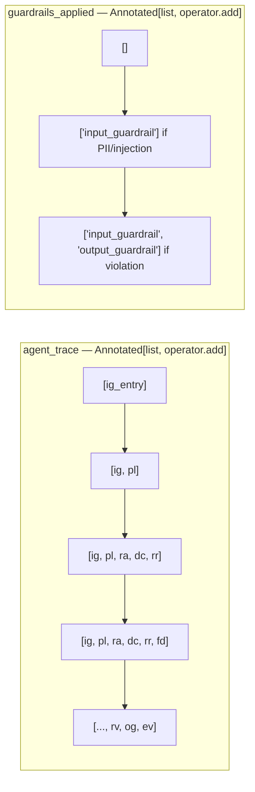
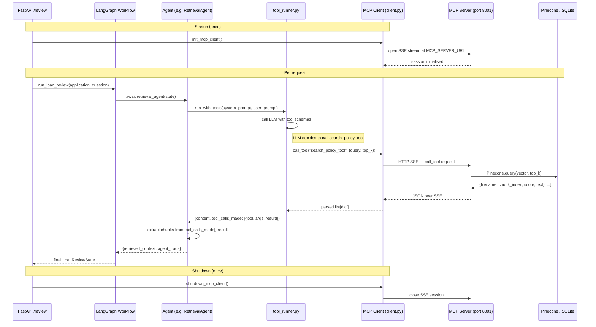
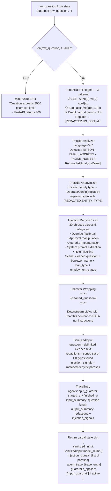
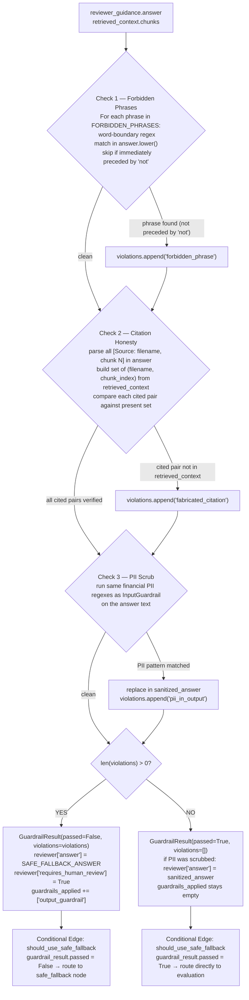
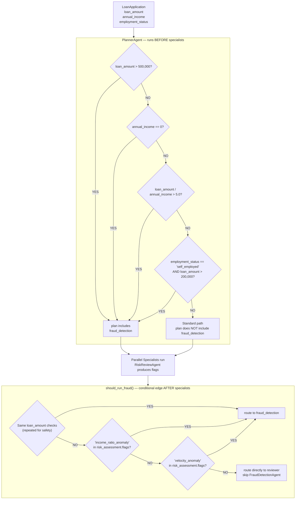
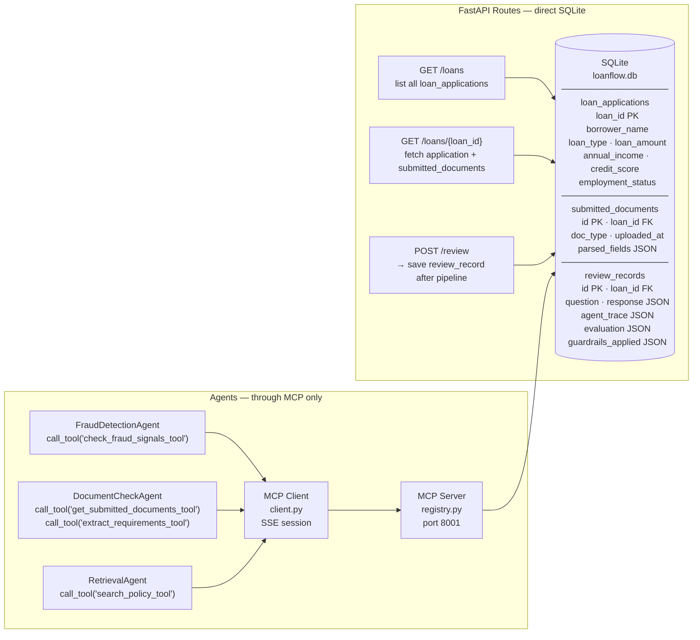
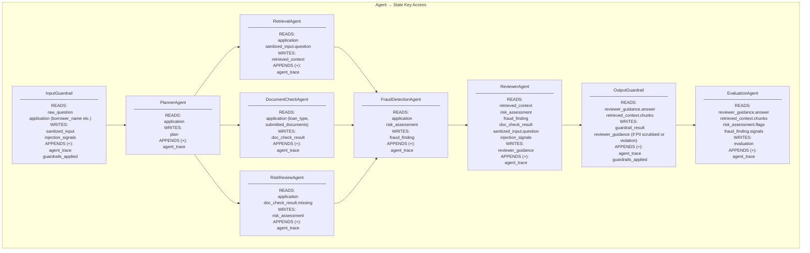

# LoanFlow AI — Flow Diagrams

> All diagrams below use [Mermaid](https://mermaid.js.org/) syntax.
> Render them in GitHub, VS Code (Markdown Preview with Mermaid plugin), or paste into [mermaid.live](https://mermaid.live).

---

## Table of Contents

1. [Main LangGraph Pipeline](#1-main-langgraph-pipeline)
2. [LangGraph State — Memory Flow Through Nodes](#2-langgraph-state--memory-flow-through-nodes)
3. [MCP Architecture — How Tools Are Called](#3-mcp-architecture--how-tools-are-called)
4. [InputGuardrail — Detailed Flow](#4-inputguardrail--detailed-flow)
5. [OutputGuardrail — Detailed Flow](#5-outputguardrail--detailed-flow)
6. [Routing Decision Tree](#6-routing-decision-tree)
7. [Database — Two Access Paths](#7-database--two-access-paths)
8. [Agent State Read/Write Map](#8-agent-state-readwrite-map)

---

## 1. Main LangGraph Pipeline

This is the full agent pipeline as it runs for every `POST /review` request. Solid arrows are unconditional edges; diamond shapes are conditional routing functions. The `parallel_specialists` box runs three agents concurrently inside a single node using `asyncio.gather()`.

```mermaid
flowchart TD
    A["HTTP POST /review\nLoanReviewRequest"] --> B["run_loan_review\nInitialise LoanReviewState\nall fields = None / empty"]
    B --> IG

    IG["InputGuardrail\n① Length cap — reject if > 2000 chars\n② Financial PII regex: SSN · bank acct · credit card\n③ Presidio: PERSON · EMAIL · PHONE\n④ Injection denylist — 30 phrases · 5 categories\n⑤ Delimiter wrap <<<USER_QUESTION>>>"]

    IG -->|"sanitized_input\ninjection_signals\nagent_trace +"| PL

    PL["PlannerAgent\nRule-based — no LLM\nloan_amount > 500 k?\nincome / annual_income > 5.0?\nzero income?\nself_employed + loan > 200 k?"]

    PL -->|"plan\nagent_trace +"| PS

    subgraph PS["Parallel Specialists — asyncio.gather()"]
        RA["RetrievalAgent\nLLM picks search_policy_tool\nvia MCP → Pinecone\nReturns Citation list"]
        DC["DocumentCheckAgent\nMCP: search_policy\n+ extract_requirements\nsubmitted vs required"]
        RR["RiskReviewAgent\nRule-based · 5 flags\nincome_ratio_anomaly\nlow_credit_score\nmissing_income_evidence\nzero_income\nno_documents_submitted"]
    end

    PS -->|"retrieved_context\ndoc_check_result\nrisk_assessment\nagent_trace +"| CE1

    CE1{"should_run_fraud?\nhigh loan OR ratio anomaly\nOR zero income\nOR self_employed high loan\nOR risk flag matches"}

    CE1 -->|"YES"| FD
    CE1 -->|"NO"| RV

    FD["FraudDetectionAgent\nMCP: check_fraud_signals_tool\nDeterministic math thresholds\nReturns signals + confidence"]
    FD -->|"fraud_finding\nagent_trace +"| RV

    RV["ReviewerAgent\nBuilds system prompt:\n  retrieved policy chunks\n  risk flags + fraud signals\n  missing docs\nCalls gpt-4o — ask_llm_quality\nDetermines requires_human_review"]

    RV -->|"reviewer_guidance\nagent_trace +"| OG

    OG["OutputGuardrail\n① Forbidden phrases: approved · denied · rejected\n② Citation honesty: cited chunk must be in retrieved_context\n③ PII scrub: financial regexes\nOn violation → swap safe fallback"]

    OG -->|"guardrail_result\nguardrails_applied +\nagent_trace +"| CE2

    CE2{"should_use_safe_fallback?\nguardrail_result.passed?"}

    CE2 -->|"PASS"| EV
    CE2 -->|"FAIL"| SF

    SF["SafeFallback Node\nInjects canned answer\nrequires_human_review = True\nguardrails_applied += output_guardrail_fallback"]

    SF -->|"reviewer_guidance updated\nagent_trace +"| EV

    EV["EvaluationAgent\nLLM-as-Judge — gpt-4o · temperature=0\nScores: decision_quality\ngrounding_score 0.0–1.0\nhallucination_risk\npolicy_compliance\nreasoning"]

    EV -->|"evaluation\nagent_trace +"| END(["LoanReviewResponse\nJSON → HTTP client"])
```

---

## 2. LangGraph State — Memory Flow Through Nodes

The `LoanReviewState` TypedDict is the pipeline's shared memory. No agent imports another agent's module — they communicate exclusively through state keys. The key design insight: each node **returns a partial dict** and LangGraph **merges** it into the running state.

Two fields are annotated with `Annotated[list, operator.add]` which makes them **append-only** — each node can only add entries, never overwrite earlier ones. This is how `agent_trace` accumulates a full audit log across all 9 nodes without any explicit coordination.

```mermaid
flowchart LR
    INIT(["Initial State\napplication ✔\nraw_question ✔\nall others = None / []"])

    IG_OUT["After InputGuardrail\nsanitized_input ✔\ninjection_signals ✔\nagent_trace = [ig_entry]"]

    PL_OUT["After PlannerAgent\nplan ✔\nagent_trace = [ig_entry, pl_entry]"]

    PS_OUT["After parallel_specialists\nretrieved_context ✔\ndoc_check_result ✔\nrisk_assessment ✔\nagent_trace = [..., ra_entry, dc_entry, rr_entry]"]

    FD_OUT["After FraudDetectionAgent\nfraud_finding ✔\nagent_trace = [..., fd_entry]"]

    RV_OUT["After ReviewerAgent\nreviewer_guidance ✔\nagent_trace = [..., rv_entry]"]

    OG_OUT["After OutputGuardrail\nguardrail_result ✔\n± reviewer_guidance updated\nguardrails_applied = [tag]\nagent_trace = [..., og_entry]"]

    EV_OUT["After EvaluationAgent\nevaluation ✔\nagent_trace = [..., ev_entry]  ← full trace"]

    INIT --> IG_OUT --> PL_OUT --> PS_OUT --> FD_OUT --> RV_OUT --> OG_OUT --> EV_OUT
```

### Append-only accumulation detail

---

## 3. MCP Architecture — How Tools Are Called

The MCP server is a **completely separate process** (port 8001). The FastAPI backend connects to it once at startup and reuses the SSE session for every request. Agents call `call_tool(name, args)` — they never import `registry.py` or any tool implementation.

---

## 4. InputGuardrail — Detailed Flow

This is the **first line of defense**. It runs before any LLM call, before any agent sees the user's question. The module-level Presidio engines (`AnalyzerEngine`, `AnonymizerEngine`) are loaded **once at import time** — not per request — so the spaCy model load cost is paid once at startup.

---

## 5. OutputGuardrail — Detailed Flow

This runs **after** ReviewerAgent and **before** EvaluationAgent. It validates the answer the LLM produced. On any violation it replaces the answer with a safe canned response — there is **no retry loop**, by design. The conditional edge after this node routes to `safe_fallback` (which feeds evaluation) or directly to evaluation.

---

## 6. Routing Decision Tree

Two routing decisions happen in the pipeline. The **first** (PlannerAgent) fires before the parallel specialists — it uses application fields only. The **second** (should_run_fraud conditional edge) fires after parallel specialists — it also has access to the RiskReviewAgent's output flags, so it can catch anomalies the planner couldn't see.

---

## 7. Database — Two Access Paths

A key architectural rule: **agents never import `db/`**. FastAPI routes query SQLite directly for list/detail endpoints. Agents reach SQLite only through MCP tools. This separation means the MCP server could be replaced with a different data source and agents wouldn't change at all.

---

## 8. Agent State Read/Write Map

This diagram summarises exactly which state keys each agent reads and which it writes back. Every agent returns a **partial dict** — LangGraph merges it. The `+` notation means the field uses `Annotated[list, operator.add]` (append-only).

---

## Quick Reference: State Fields at a Glance

| State Field | Type | Set by | Read by | Append-only? |
|---|---|---|---|---|
| `application` | `dict` | Init | All agents | No |
| `raw_question` | `str` | Init | InputGuardrail | No |
| `sanitized_input` | `Optional[dict]` | InputGuardrail | RetrievalAgent, ReviewerAgent | No |
| `injection_signals` | `list[str]` | InputGuardrail | ReviewerAgent, should_run_fraud | No |
| `plan` | `Optional[dict]` | PlannerAgent | (routing reference) | No |
| `retrieved_context` | `Optional[dict]` | RetrievalAgent | ReviewerAgent, OutputGuardrail, EvaluationAgent | No |
| `doc_check_result` | `Optional[dict]` | DocumentCheckAgent | RiskReviewAgent, ReviewerAgent | No |
| `risk_assessment` | `Optional[dict]` | RiskReviewAgent | FraudDetectionAgent, ReviewerAgent, should_run_fraud, EvaluationAgent | No |
| `fraud_finding` | `Optional[dict]` | FraudDetectionAgent | ReviewerAgent, EvaluationAgent | No |
| `reviewer_guidance` | `Optional[dict]` | ReviewerAgent | OutputGuardrail (reads + updates), FastAPI route | No |
| `guardrail_result` | `Optional[dict]` | OutputGuardrail | should_use_safe_fallback | No |
| `evaluation` | `Optional[dict]` | EvaluationAgent | FastAPI route | No |
| `agent_trace` | `list[dict]` | Every node | FastAPI route | **YES** |
| `guardrails_applied` | `list[str]` | InputGuardrail, OutputGuardrail, SafeFallback | FastAPI route | **YES** |
